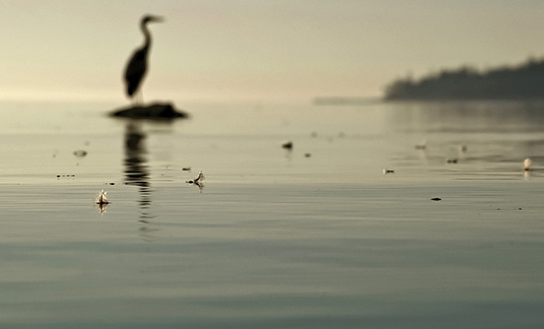
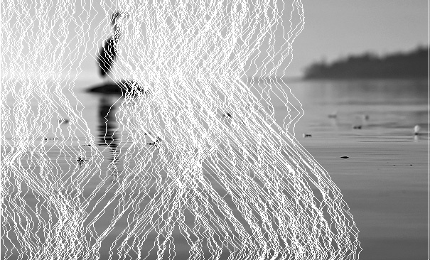
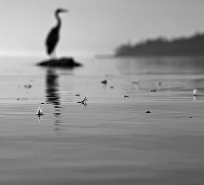
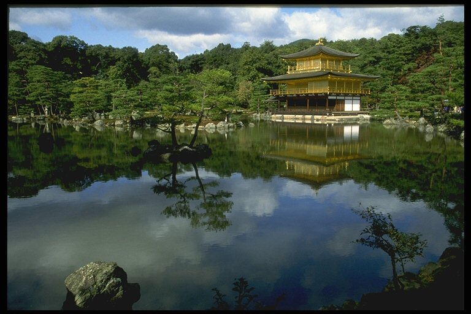
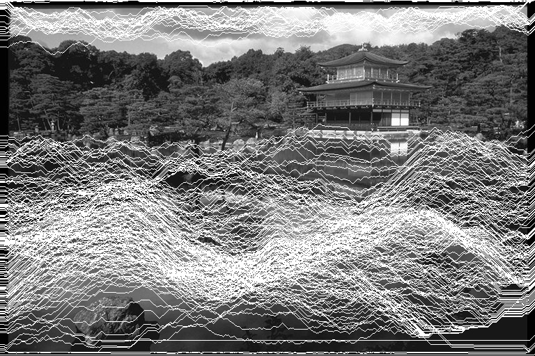
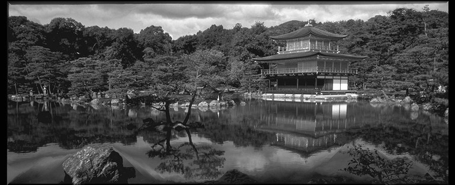

# Traitement d'images par filtres
CHPS0703 - Imagerie 

### Informations
**Nécessite d'installer la bibliothèque OpenCV.**

À l'execution, le programme va créer un répertoire `/images` à la racine et à l'intérieur un répertoire avec le nom de l'image. <br>
Supporte les extensions basiques : jpg, png.

Si nécessaire sous Linux, déplacer le répertoire `opencv2` qui se trouve dans `/usr/include/opencv4/`, vers le répertoire `/usr/include`, car il est possible que ce répertoire se trouve dans `/opencv4` et donc le compilateur ne trouve pas les fichiers d'en-tête.

---------------
#### Compilation
```sh
make
```

#### Execution
```sh
./main path/path/file.jpg
```

## Filtres
- binarisation
- négatif
- quantification
- réhaussement
- égalisation
- érosion
- dilatation
- ouverture
- fermeture
- moyenne
- gaussien
- minimum
- maximum
- médiane
- sobel
- sharr
- laplacien v1
- laplacien v2
- bilatéralisation
- energymap

## Seam carving gray
*Collaborators : [clem1408](https://github.com/clem1408) & [kakugen](https://github.com/KaKug3n)* <br>
Algorithme permattant d'éliminer les zones à faible densité d'information dans une image afin d'en réduire sa taille. <br>
L'algo présenté est pour la suppréssion de colonnes mais la mécanique est similaire pour la suppression de lignes.

### Pré-traitement
Application d'un filtre gaussien afin de lisser l'image et d'un filtre gradient afin de faire ressortir les bords des objets.

### Matrice cumulative
Création d'une matrice cumulative aux dimensions de l'image.

#### Algorithme
- Initialisation de la 1ère ligne de la matrice avec la 1ère ligne de l'image (ligne 0).
- À partir de la ligne 1 et en boucle jusqu'en bas de l'image. Dans la case courante de la matrice, placer la somme du pixel courant et de la case minimum des 3 case au dessus de la case courante de la matrice.
- Faire attention aux cas sur les bords droit et gauche, afin de ne pas sortir de l'image pour chercher le pixel minimum.

### Recherche du chemin minimum
Avec la matrice cumulative rechercher le chemin minimum de l'image.

#### Algorithme
- Parcourir la dernière ligne pour trouver l'indice de la valeur minimum et l'ajouter à un tableau `path` de la taille de la hauteur de l'image.
- À partir de cet indice rechercher parmis les 3 pixels au dessus, le pixel minimum, l'ajouter au tableau "path" et prendre ce pixel comme référence d'indice de recherche.
- Répéter jusqu'en haut de l'image.

### Suppression du chemin minimum
Avec le tableau `path`, supprimer le chemin de l'image.

#### Algorithme
- Parcourir le tableau `path` et supprimer le pixel à l'indice i et à la valeur de la case i deu tableau `path`
- Décaler tous les pixels de l'image vers la droite ou la gauche.
- Répéter ceci jusqu'en haut de l'image.

### Algorithme générale
Répéter n fois dans l'ordre.
- Création d'une matrice cumulative de l'image.
- Rechercher le chemin minimum.
- Supprimer le chemin minimum.

Il faut toujours utiliser l'image qui est modifiée afin de pouvoir trouver un nouveau chemin minimum.

#### Compilation
```sh
make
```

#### Execution
- main : fichier principale d'exécution
- path : chemin vers l'image
- seam : nombre de seams (chemin) à retirer
- type : 1 > colonnes | 2 > lignes | 3 > colonnes + lignes
```sh
./main path/path/file.jpg 300 1
```

Pour le seam carving en couleur : [Colored seamcarving](https://github.com/clem1408/CHPS0703-Project)

## Example rows
 

Original 



Paths 



Resized

## Example colums
 

Original 



Paths 



Resized
